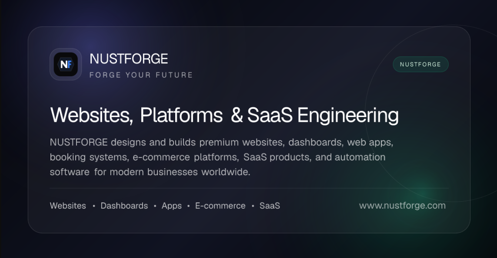

<h1 align="center">
  Hi 👋, I'm Muhammad Harris Baig
</h1>

<h3 align="center">
  Full Stack & AI Engineer • Founder of NUSTFORGE • SaaS & Business Software Builder
</h3>

  I build production-ready SaaS platforms, business applications, dashboards,
  booking systems, e-commerce solutions, AI-powered applications, and automation systems.

  React • Next.js • TypeScript • Node.js • Laravel • PostgreSQL • AWS • AI & Automation

  🇬🇧 UK • 🇺🇸 USA • 🇦🇪 UAE • 🌏 Asia • 🌍 Global

  <a href="https://www.nustforge.com">NUSTFORGE</a> •
  <a href="https://harris-baig-portfolio.vercel.app/">Portfolio</a> •
  <a href="https://www.linkedin.com/in/harrisbaig7/">LinkedIn</a> •
  <a href="https://github.com/Harrisbaig7">GitHub</a>

---

## 👨‍💻 About Me

I'm a **Full Stack & AI Engineer** with 3+ years of experience designing and delivering production-ready software for UK-based and international clients.

I work across the full software development lifecycle — from **UI/UX implementation and backend architecture to database design, API integrations, cloud infrastructure, testing, and production deployment**.

My focus is building reliable software around real business requirements, with an emphasis on **clean architecture, scalable systems, polished user experiences, and maintainable code**.

* 🚀 Founder of [NUSTFORGE](https://www.nustforge.com)
* 💻 Full Stack & AI Engineer focused on modern web and business software
* 🏗️ Experienced in SaaS, multi-role applications, dashboards, and operational platforms
* ☁️ Hands-on experience with AWS, Vercel, Docker, CI/CD, and production deployments
* 🤖 Building AI-powered applications, integrations, and business automation workflows
* 🌍 Working with UK-based and international clients across global markets

---

## ⚡ What I Build

I build modern software for real business workflows, from customer-facing applications to internal business platforms.

* 🚀 SaaS & business applications
* 📊 Dashboards & admin panels
* 📅 Booking & appointment systems
* 🛒 E-commerce & payment workflows
* 🔐 Authentication & role-based applications
* 🔌 APIs & third-party integrations
* 🤖 AI-powered applications & automation
* 📱 Web & mobile applications
* ☁️ Cloud-based software & deployments
* 🌐 Business websites & digital platforms

---

## 🏢 NUSTFORGE

**NUSTFORGE** is my software engineering studio focused on building modern websites, SaaS platforms, business applications, AI solutions, and custom digital systems.

### What I Work On

* 🚀 SaaS & custom business software
* 📊 Dashboards, admin panels & customer portals
* 📅 Booking, reservation & appointment systems
* 💳 Payment & subscription workflows
* 🔐 Authentication & role-based applications
* 🔌 API integrations & business workflows
* 🤖 AI-powered applications & automation
* 🌐 High-performance business websites

### Engineering Focus

* Full-stack web development
* Scalable application architecture
* PostgreSQL & database-driven systems
* Third-party API integrations
* Payment gateways & subscription systems
* Cloud deployment & production infrastructure
* Responsive UI, performance optimization & SEO

---

## 📚 Open-Source Engineering Resource

### 🧭 Modern Web Development Guide

A practical, evolving reference covering modern web development and production engineering — including frontend architecture, AI engineering, SaaS design, security, APIs, databases, payments, performance, deployment, testing, and developer workflow.

**Focus:** Practical patterns • Production Engineering • SaaS • AI • Security • Cloud

---

## 💼 Featured Projects

### 🏢 ServiPro — Enterprise Procurement SaaS

Production B2B SaaS platform for UK property and service-contract procurement workflows.

* Multi-role dashboards for administrators, managing agents & contractors
* Tender, bidding, procurement & contract workflows
* Contractor onboarding & UK business verification
* Subscription & payment workflows
* Invoicing & document management
* Notifications & real-time business workflows
* Role-based authentication & access control
* PostgreSQL database architecture & cloud document storage

**Stack:** Next.js • React • TypeScript • Node.js • PostgreSQL • Prisma • Stripe • AWS S3

---

### 💇 Loft Aesthetics — Salon Management Platform

Production salon platform combining a customer-facing website with business management functionality.

* Service & product management
* Booking & appointment workflows
* Secure admin dashboard
* Authentication & role-based access
* Payment integration
* Content management
* Responsive UI, SEO & performance optimization

**Stack:** Next.js • React • TypeScript • Supabase • Stripe

---

### 🚖 UK Taxi Dispatch SaaS

Private-hire operational SaaS platform built around booking, dispatch and fleet management workflows.

* Booking & reservation management
* Pricing & payment workflows
* Driver & vehicle management
* Customer management
* Dispatch operations
* Administrative dashboards
* Role-based workflows & API integrations

**Stack:** Next.js • Node.js • Prisma • PostgreSQL • Stripe • REST APIs

---

### 🤖 DonateNotWaste — AI-Powered Food Waste Platform

🏆 **1st Position — University Final Year Project Expo**

Web and mobile platform focused on food donation, delivery tracking, fundraising and administration.

* Food donation management
* Delivery & logistics workflows
* Fundraising features
* Admin management
* AI-powered food image classification
* Real-time detection capabilities

**Stack:** React • Node.js • MongoDB • AI/ML • Mobile Technologies

---

### 🌐 NUSTFORGE — Software Engineering Studio

My software engineering studio focused on building production websites, SaaS platforms, business applications, AI solutions and custom digital systems.

**Focus:** Full-Stack Development • SaaS • Business Software • AI • Automation • Cloud • SEO

---

## 🧠 Technical Expertise

### Frontend

  

### Backend

  

### Databases

  

### Cloud & DevOps

  

### AI & Automation

* 🤖 AI Chatbots & AI Assistants
* 🧠 AI API Integration
* 👁️ Image Classification
* ✨ Prompt Engineering
* ⚙️ Workflow & Business Automation
* 🐍 Python Automation

### Payments & Integrations

* 💳 Stripe & Payment Gateways
* 🔄 Subscription & Billing Systems
* 📅 Booking & Reservation Integrations
* 🔌 REST APIs & Third-Party Integrations
* 🪝 Webhooks & API Workflows

### Software Engineering

* 🏢 SaaS Application Development
* 🔐 Authentication & Role-Based Access Control
* 📊 Business & Admin Dashboards
* 🛒 E-commerce Systems
* 📱 Web & Mobile Applications
* 🎨 Responsive UI/UX Implementation
* 🚀 Performance Optimization
* 🔍 SEO & Technical SEO
* 🧩 System Design

### Development & Collaboration Tools

  

* 🧪 API Testing & Debugging
* 🐛 Troubleshooting & Problem Solving
* ✅ Testing & Quality Assurance
* 🔄 CI/CD & Deployment Workflows
* 📋 Project & Task Management
* 🤝 Team Collaboration & Development Workflows

---

## 🏗️ Engineering Focus

I enjoy building software around real business requirements, focusing on reliable workflows, maintainable architecture, and polished production experiences.

* 🚀 Turning business requirements into production-ready software
* 🏢 Designing SaaS & multi-role business platforms
* 🔄 Building complex business workflows and operational systems
* 💳 Implementing payments, subscriptions & transactional workflows
* 📅 Developing booking, reservation & appointment experiences
* 📊 Building dashboards for business operations and management
* 🔌 Connecting systems through APIs and third-party services
* 🤖 Applying AI and automation to practical business use cases
* ☁️ Taking applications from development through production deployment
* 🎯 Improving usability, performance, accessibility & SEO

---

## 📊 GitHub Engineering Stats

  

  
  

---

## 📈 Contribution Analytics

  

---

## 🐍 Contribution Activity

<picture>
  <source
    media="(prefers-color-scheme: dark)"
    srcset="https://raw.githubusercontent.com/Harrisbaig7/Harrisbaig7/output/github-contribution-grid-snake-dark.svg"
  />
  <source
    media="(prefers-color-scheme: light)"
    srcset="https://raw.githubusercontent.com/Harrisbaig7/Harrisbaig7/output/github-contribution-grid-snake.svg"
  />
  
</picture>

 

Code • Build • Ship • Repeat

---

## 🎯 Currently Focused On

* 🚀 Building and scaling production-ready SaaS platforms
* 🤖 Developing practical AI-powered applications & automation
* 🏢 Creating business software around real-world workflows
* ☁️ Improving cloud architecture, deployment & infrastructure
* 🧩 Designing scalable, maintainable full-stack systems
* 🌍 Working with international clients and global businesses
* 📚 Continuously exploring modern technologies and better engineering practices

---

## 🤝 Let's Connect

I'm always open to discussing software engineering, SaaS products, AI automation, business applications, and potential collaborations.

  
  
  
  
  

  Full Stack Engineering • SaaS • AI & Automation • Business Software

